## Java 可伸缩线程池 (StretchableThreadPool)

### 🛠 食用方法

```Java
// 详情见项目的测试类
public void howToUse() {
    // 1.创建可伸缩线程池对象
    StretchableThreadPool pool = new StretchableThreadPool();
    
    // 2.初始化线程池（线程池在这里需要传入四个初始化参数）
    // (1):minThreadCount 线程池最小线程数目
    // (2):maxThreadCount 线程池最大线程数目
    // (3):maxWaitSeconds 当前线程等待maxWaitSeconds秒后仍然接收不到新来的任务就会自杀
    // (4):addOnceThreadCount 线程池可以扩增时，一次批量增加的线程数
    pool.initThreadPool(5, 15, 3, 5);
    
    // 3.将你需要执行的任务用createNewWork方法放入线程池中执行
    // 由于Java不支持函数式编程，这里要传入Runnable接口的子实现类，重写run方法作为你要执行的真正任务
    pool.createNewWork(new ActualWork(10));
}

@Slf4j
@AllArgsConstructor
class ActualWork implements Runnable {
    // 可以用成员变量支持参数传递（由于Runnable不支持参数传递）
    private Integer workId;

    @Override
    public void run() {
        // 1.工作时打印当前任务的ID号
        log.info("work {} run in the thread pool", workId);
        // 2.当前线程睡上5s（模拟当前线程处理该任务5s）
        try {
            Thread.sleep(5 * 1000);
        } catch (InterruptedException e) {
            log.error(e.getMessage());
        }
        // 3.当前任务结束
        log.info("work {} end", workId);
    }
}
```

### 🌍 设计原则

#### 🔒 锁设计

> 只设置一把“大”的互斥锁，由于任务队列和线程池列表均使用了**非同步**的数据结构，**因此需要这把锁同时锁住线程池对象和任务队列对象**。涉及到添加新任务和线程内任务调度时均需要使用这把锁进行同步控制（保证同一时刻始终只有一个线程持有锁，不会出现死锁现象）。
>
> 使用时只涉及一把锁，这种设计有效地**防止了死锁现象**的发生，这把锁**只有在线程后台真正执行用户传入的任务对象时被释放**（任务执行完毕后重新与其它线程竞争锁恢复状态），保证了操作的原子性。由于线程要执行的任务时间长而这些其它原子性操作执行速度快，因此这种设计又不失线程池“后台”多线程执行任务的高效性。

#### 🔨 调度原则（线程自身调度自身）



> 每个线程均在一个 while(true) 循环中不断循环等待任务，调度主要分为以下情况

- 当前线程在循环中一上来就发现任务队列中存在可执行的任务，那么就取出该任务执行
- 当前线程一上来没有发现任务队列中存在可执行的任务，那么就**进入该锁的一个条件变量上进行超时等待**（**等待的同时释放对象锁**，其他线程也可以竞争锁判断）
  - 若当前线程等待未超时，**一定说明任务队列中出现了新的任务**（**创建任务时，会往条件变量里发 signal 信号随机唤醒其中的一个正在超时等待的线程工作**），此时这个被唤醒的线程重新进入循环抢锁执行新任务，如果有机会抢到锁就可以执行新任务，没有抢过其他线程就继续等待
  - 若当前线程等待超过预设的超时等待时间，这时候当前线程要**检查是否可以自杀**，如果当前线程满足自杀条件，那么当前线程自杀从而退出任务循环，线程池线程数量缩减；若不可以自杀则继续进入任务循环

#### 🎨 线程池线程数量动态伸缩原则

> 动态增加线程数目：在创建任务时检查当前线程池是否存在空闲的线程，**若创建新任务时不存在空闲线程且当前线程池中线程总数小于预设的 maxThreadCount 最大线程数量**，说明可以动态扩充，**一次批量增加 addOnceThreadCount 个数目**的线程。
>
> 动态缩减线程数目：每个线程在自身的任务循环中若**等待超时（在条件变量中等待 maxWaitSeconds 秒后仍然没有收到条件变量发来的新任务来临信号，这个线程继续等也没有意义）**，**若当前线程池线程数大于预设的线程池最小线程数 minThreadCount ，说明当前线程可以自杀，线程池动态缩减**，若当前线程池线程数已经是预设的线程池最小线程数，不可以自杀，继续循环接受任务。

#### 📌 设计模式-策略模式

> 使用 Runnable 接口聚合在线程池的任务对象中，使用时可以动态传入自身覆写的策略对象作为实际任务对象传入线程池，利用多态使任务队列不依赖于某个具体任务而依赖于一个抽象的通用接口，可拓展性强，耦合度低

### ✔ 线程池伸缩性测试输出

#### 🔍 测试类代码

```Java
package com.fyh.threadpool;

import com.fyh.threadpool.main.StretchableThreadPool;
import lombok.AllArgsConstructor;
import lombok.Data;
import lombok.extern.slf4j.Slf4j;
import org.junit.jupiter.api.Test;
import org.springframework.boot.test.context.SpringBootTest;

@Slf4j
@SpringBootTest
class ThreadPoolApplicationTest {

    @Test
    public void testStretchablePool() throws InterruptedException {
        // 1.测试线程池，创建可伸缩线程池对象
        StretchableThreadPool pool = new StretchableThreadPool();

        // 2.初始化线程池，设置伸缩范围[5,15]，等待3s自杀，一次批量增加5个线程
        pool.initThreadPool(5, 15, 3, 5);

        // 3.初始化后用createNewWork传入一个实现了Runnable接口的任务对象，自动执行run方法
        for (int i = 0; i < 30; i++) {
            pool.createNewWork(new ActualWork(i + 1));
            Thread.sleep(100);
        }

        // 4.等待15s测试彻底结束
        Thread.sleep(15 * 1000);
        log.info("all work finished");
    }
}

@Data
@Slf4j
@AllArgsConstructor
class ActualWork implements Runnable {
    private Integer workId;

    @Override
    public void run() {
        // 1.工作时打印当前任务的ID号
        log.info("work {} run in the thread pool", workId);

        // 2.当前线程睡上5s（模拟当前线程处理该任务5s）
        try {
            Thread.sleep(5 * 1000);
        } catch (InterruptedException e) {
            log.error(e.getMessage());
        }

        // 3.当前任务结束
        log.info("work {} end", workId);
    }
}
```

#### 📄 测试输出日志解析

```Java
ThreadId       --- LogContent
    
# ----------------------------------------------------------------- #
# 初始化时线程池设置最小有五个线程可以使用，最大有15个线程可以使用
# 任务队列中放30个任务，每个任务打印当前任务的ID号
main           --- [ thread pool created, now has 5 threads ]
# ----------------------------------------------------------------- #
    
# ----------------------------------------------------------------- #
# 新任务来了，线程从等待状态被条件变量唤醒执行任务
main           --- [ new work added for function ActualWork(workId=1) ]
1              --- [ thread 1 called by cond obj ]
1              --- [ ActualWork(workId=1)} ]
1              --- [ work 1 run in the thread pool ]
main           --- [ new work added for function ActualWork(workId=2) ]
4              --- [ thread 4 called by cond obj ]
4              --- [ ActualWork(workId=2)} ]
4              --- [ work 2 run in the thread pool ]
main           --- [ new work added for function ActualWork(workId=3) ]
5              --- [ thread 5 called by cond obj ]
5              --- [ ActualWork(workId=3)} ]
5              --- [ work 3 run in the thread pool ]
main           --- [ new work added for function ActualWork(workId=4) ]
3              --- [ thread 3 called by cond obj ]
3              --- [ ActualWork(workId=4)} ]
3              --- [ work 4 run in the thread pool ]
main           --- [ new work added for function ActualWork(workId=5) ]
2              --- [ thread 2 called by cond obj ]
2              --- [ ActualWork(workId=5)} ]
2              --- [ work 5 run in the thread pool ]
# ----------------------------------------------------------------- #
    
# ----------------------------------------------------------------- #
main           --- [ new work added for function ActualWork(workId=6) ]
main           --- [ * thread pool extended. now has 10 threads ]
# 已经有5个线程在打工了，此时池子里面没有空闲的线程了（但是任务还在来），线程数还没到达预设的最大值
# 因此需要扩容，按照每次递增5个线程来进行线程数目的增加，此时有10个线程了，继续分配新来的任务执行
# ----------------------------------------------------------------- #
    
# ----------------------------------------------------------------- #
6              --- [ ActualWork(workId=6)} ]
6              --- [ work 6 run in the thread pool ]
main           --- [ new work added for function ActualWork(workId=7) ]
7              --- [ thread 7 called by cond obj ]
7              --- [ ActualWork(workId=7)} ]
7              --- [ work 7 run in the thread pool ]
main           --- [ new work added for function ActualWork(workId=8) ]
8              --- [ thread 8 called by cond obj ]
8              --- [ ActualWork(workId=8)} ]
8              --- [ work 8 run in the thread pool ]
main           --- [ new work added for function ActualWork(workId=9) ]
9              --- [ thread 9 called by cond obj ]
9              --- [ ActualWork(workId=9)} ]
9              --- [ work 9 run in the thread pool ]
main           --- [ new work added for function ActualWork(workId=10) ]
10             --- [ thread 10 called by cond obj ]
10             --- [ ActualWork(workId=10)} ]
10             --- [ work 10 run in the thread pool ]
# ----------------------------------------------------------------- #


# ----------------------------------------------------------------- #
# 已经有10个线程在打工了，此时池子里面没有空闲的线程了（但是任务还在来），线程数还没到达预设的最大值
# 因此需要扩容，按照每次递增5个线程来进行线程数目的增加，此时有15个线程了，继续分配新来的任务执行
# 注意这里已经有15个，达到了预设的最大值了，线程池如果任务再来了就没办法继续扩充了
main           --- [ new work added for function ActualWork(workId=11) ]
main           --- [ * thread pool extended. now has 15 threads ]
# ----------------------------------------------------------------- #

# ----------------------------------------------------------------- #
11             --- [ ActualWork(workId=11)} ]
11             --- [ work 11 run in the thread pool ]
main           --- [ new work added for function ActualWork(workId=12) ]
12             --- [ thread 12 called by cond obj ]
12             --- [ ActualWork(workId=12)} ]
12             --- [ work 12 run in the thread pool ]
main           --- [ new work added for function ActualWork(workId=13) ]
13             --- [ thread 13 called by cond obj ]
13             --- [ ActualWork(workId=13)} ]
13             --- [ work 13 run in the thread pool ]
main           --- [ new work added for function ActualWork(workId=14) ]
14             --- [ thread 14 called by cond obj ]
14             --- [ ActualWork(workId=14)} ]
14             --- [ work 14 run in the thread pool ]
main           --- [ new work added for function ActualWork(workId=15) ]
15             --- [ thread 15 called by cond obj ]
15             --- [ ActualWork(workId=15)} ]
15             --- [ work 15 run in the thread pool ]
# ----------------------------------------------------------------- #
    
# ----------------------------------------------------------------- #
# 新任务加入，无法扩充，线程都在忙，因此在队列中等待处理
main           --- [ new work added for function ActualWork(workId=16) ]
main           --- [ new work added for function ActualWork(workId=17) ]
main           --- [ new work added for function ActualWork(workId=18) ]
main           --- [ new work added for function ActualWork(workId=19) ]
main           --- [ new work added for function ActualWork(workId=20) ]
main           --- [ new work added for function ActualWork(workId=21) ]
main           --- [ new work added for function ActualWork(workId=22) ]
main           --- [ new work added for function ActualWork(workId=23) ]
main           --- [ new work added for function ActualWork(workId=24) ]
main           --- [ new work added for function ActualWork(workId=25) ]
main           --- [ new work added for function ActualWork(workId=26) ]
main           --- [ new work added for function ActualWork(workId=27) ]
main           --- [ new work added for function ActualWork(workId=28) ]
main           --- [ new work added for function ActualWork(workId=29) ]
main           --- [ new work added for function ActualWork(workId=30) ]
# ----------------------------------------------------------------- #
    
# ----------------------------------------------------------------- #
# 线程处理完旧任务，可以继续处理新任务
1              --- [ work 1 end ]
1              --- [ ActualWork(workId=16)} ]
1              --- [ work 16 run in the thread pool ]
4              --- [ work 2 end ]
4              --- [ ActualWork(workId=17)} ]
4              --- [ work 17 run in the thread pool ]
5              --- [ work 3 end ]
5              --- [ ActualWork(workId=18)} ]
5              --- [ work 18 run in the thread pool ]
3              --- [ work 4 end ]
3              --- [ ActualWork(workId=19)} ]
3              --- [ work 19 run in the thread pool ]
2              --- [ work 5 end ]
2              --- [ ActualWork(workId=20)} ]
2              --- [ work 20 run in the thread pool ]
6              --- [ work 6 end ]
6              --- [ ActualWork(workId=21)} ]
6              --- [ work 21 run in the thread pool ]
7              --- [ work 7 end ]
7              --- [ ActualWork(workId=22)} ]
7              --- [ work 22 run in the thread pool ]
8              --- [ work 8 end ]
8              --- [ ActualWork(workId=23)} ]
8              --- [ work 23 run in the thread pool ]
9              --- [ work 9 end ]
9              --- [ ActualWork(workId=24)} ]
9              --- [ work 24 run in the thread pool ]
10             --- [ work 10 end ]
10             --- [ ActualWork(workId=25)} ]
10             --- [ work 25 run in the thread pool ]
11             --- [ work 11 end ]
11             --- [ ActualWork(workId=26)} ]
11             --- [ work 26 run in the thread pool ]
12             --- [ work 12 end ]
12             --- [ ActualWork(workId=27)} ]
12             --- [ work 27 run in the thread pool ]
13             --- [ work 13 end ]
13             --- [ ActualWork(workId=28)} ]
13             --- [ work 28 run in the thread pool ]
14             --- [ work 14 end ]
14             --- [ ActualWork(workId=29)} ]
14             --- [ work 29 run in the thread pool ]
15             --- [ work 15 end ]
15             --- [ ActualWork(workId=30)} ]
15             --- [ work 30 run in the thread pool ]
1              --- [ work 16 end ]
4              --- [ work 17 end ]
5              --- [ work 18 end ]
3              --- [ work 19 end ]
2              --- [ work 20 end ]
6              --- [ work 21 end ]
7              --- [ work 22 end ]
8              --- [ work 23 end ]
9              --- [ work 24 end ]
10             --- [ work 25 end ]
11             --- [ work 26 end ]
12             --- [ work 27 end ]
13             --- [ work 28 end ]
14             --- [ work 29 end ]
15             --- [ work 30 end ]
# 分配的30个任务此时都被这些线程做完了
# ----------------------------------------------------------------- #

# ----------------------------------------------------------------- #
# 原来的15个线程一直在等，等半天也等不到新任务了（因为预设了30个任务）
# 等不到就开始自动销毁，一个一个自杀，直到预设的最小线程数量5就停止自杀
1              --- [ * thread 1 end, left 14 threads in pool ]
4              --- [ * thread 4 end, left 13 threads in pool ]
5              --- [ * thread 5 end, left 12 threads in pool ]
3              --- [ * thread 3 end, left 11 threads in pool ]
2              --- [ * thread 2 end, left 10 threads in pool ]
6              --- [ * thread 6 end, left 9 threads in pool ]
7              --- [ * thread 7 end, left 8 threads in pool ]
8              --- [ * thread 8 end, left 7 threads in pool ]
9              --- [ * thread 9 end, left 6 threads in pool ]
10             --- [ * thread 10 end, left 5 threads in pool ]
# ----------------------------------------------------------------- #
main           --- [ all work finished ]
```

